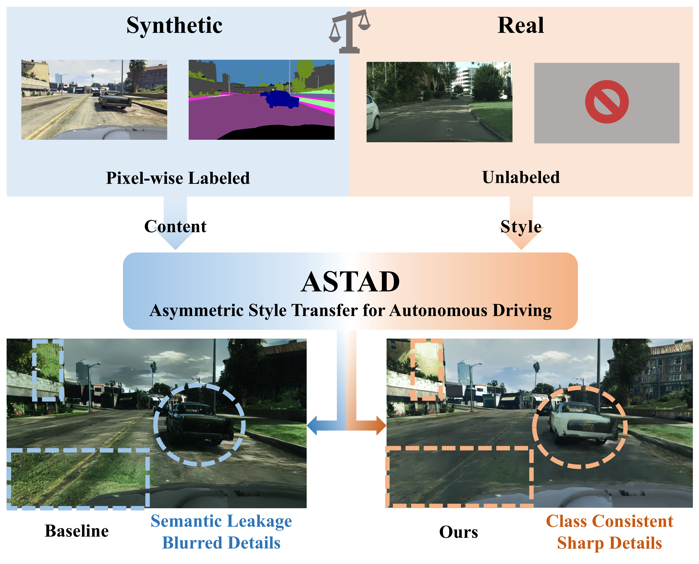
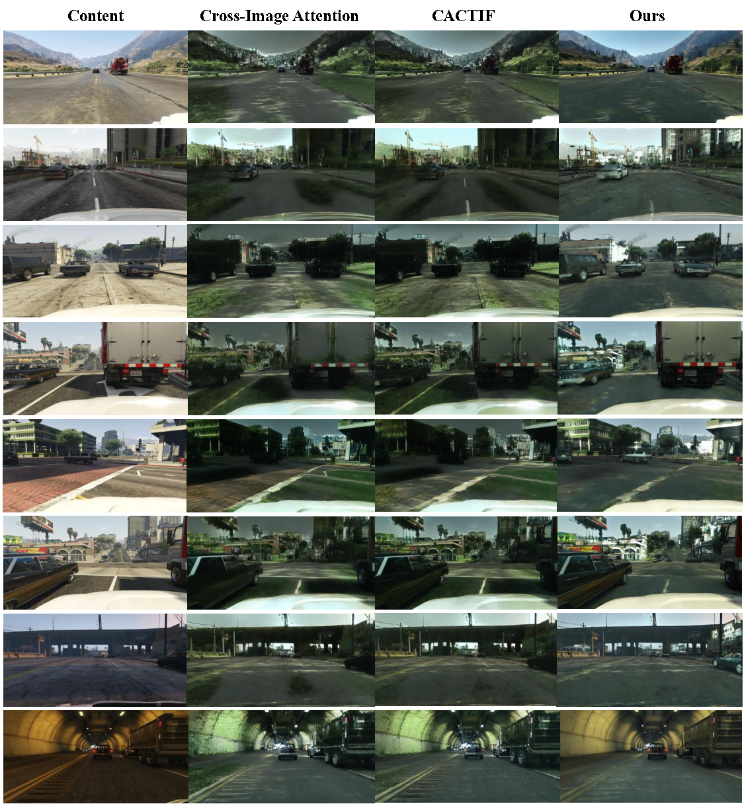

# ASTAD: Asymmetric Style Transfer for Synthetic-to-Real Adaptation in Autonomous Driving

[](https://arxiv.org/abs/2606.29286)


🏆 **Accepted to The 19th European Conference on Computer Vision (ECCV 2026)**

This repository is the official PyTorch implementation of **ASTAD** — a novel task and open benchmark for **Asymmetric Style Transfer for Autonomous Driving**.

---

## 📄 Abstract

Synthetic data mitigates the data scarcity problem in autonomous driving perception. However, the synthetic-to-real gap leads to performance degradation, hindering real-world model generalization. Although current methods leverage diffusion models for photorealistic style transfer to bridge this gap, they critically ignore a practical asymmetry: while synthetic data possesses perfect pixel-level annotations, real-world style reference images generally lack corresponding labels. Consequently, existing methods relying on symmetric semantic guidance suffer from either prohibitive annotation costs or severe semantic misalignment. To address this dilemma, we formally propose a novel task: Asymmetric Style Transfer for Autonomous Driving (ASTAD), which requires semantically consistent transfer using only labeled synthetic content and unlabeled real-world references. We further introduce the ASTModel, a training-free two-stage framework designed to bridge this domain gap under asymmetric constraints. ASTModel first extracts a coarse semantic prior from the unlabeled target, followed by dynamic prior refinement and class-consistent style injection during the denoising process. Extensive experiments demonstrate that ASTModel significantly outperforms existing methods in downstream perception utility and structural fidelity, while offering a 3.2× inference speedup. This work aligns synthetic-to-real adaptation with practical constraints, holding the potential to accelerate the scalable deployment of robust autonomous driving systems. 

<p align="center">
  
</p>
<p align="center"><em>Illustration of ASTAD and the motivation of ASTModel. Top: asymmetric synthetic-to-real style transfer. Bottom: ASTModel enables class-consistent style injection with preserved geometry.</em></p>


---

## 🧩 Method Overview

<p align="center">
  
</p>
<p align="center"><em>Overview of the proposed ASTModel: a training-free, two-stage framework under asymmetric constraints.</em></p>

ASTModel operates in two stages:

1. **Stage I — Prototype-Guided Style Semantic Prior Extraction**: leverages the semantic correspondence between synthetic prototypes and style features in the DINOv2 space to extract a coarse *Style Segmentation Prior*, solving the semantic cold-start problem via foundation models.
2. **Stage II — Asymmetric Style Injection**: refines the prior through **Multi-Layer Semantic Voting** during the diffusion reverse process, and performs style injection using **Semantically Constrained Adaptive Attention Filtering** and **Pixel-Proportion Modulated Hybrid AdaIN**.

---

## 📊 Quantitative Results

**Downstream Segmentation** (SegFormer, on GTA5 → Cityscapes style)

| Method | Pixel Acc ↑ | mIoU ↑ |
| --- | --- | --- |
| Source Only | 0.844 | 0.275 |
| Cross-Image Attn. | 0.653 | 0.224 |
| CACTIF | 0.782 | 0.289 |
| **ASTModel (Ours)** | **0.847** | **0.309** |

**Structural Fidelity** (LPIPS ↓)

| Method | LPIPS ↓ |
| --- | --- |
| Cross-Image Attn. | 0.5205 |
| CACTIF | 0.4184 |
| **ASTModel (Ours)** | **0.3588** |

**Computational Efficiency** (per image / total for 5,000 images)

| Method | Time ↓ | Total ↓ |
| --- | --- | --- |
| Cross-Image Attn. | 18s | 28h |
| CACTIF | 80s | 114h |
| **ASTModel (Ours)** | **25s** | **37h** |

---

## 🧬 Code Structure

```text
code/
├── run.py                      # Main entry point for dataset stylization
├── ast_model.py                # Core ASTModel (two-stage transfer logic)
├── config.py                   # Global configuration & data paths (Pyrallis)
├── constants.py                # Batch indices (output/style/content)
├── palettes.py                 # GTA / Cityscapes label palettes
├── models/
│   ├── stable_diffusion.py     # SD pipeline with cross-image attention
│   └── unet_2d_condition.py    # Modified U-Net with Free-U mechanisms
└── utils/
    ├── seg_prior_utils.py      # Stage I: DINOv2 semantic prior extraction
    ├── seg_utils.py            # Pseudo-segmentation during denoising (Stage II voting)
    ├── adain.py                # Pixel-Proportion Modulated Hybrid AdaIN
    ├── attention_utils.py      # Attention filtering & cross-attention utilities
    ├── latent_utils.py         # DDPM inversion & latent loading
    ├── ddpm_inversion.py       # Inversion helpers
    ├── mask_utils.py           # Label relabeling & mask processing
    ├── model_utils.py          # Stable Diffusion model loading
    └── image_utils.py          # Image loading / resizing
```

---

## 🛠 Installation

We recommend using Anaconda to manage the environment.

```bash
# Clone the repository
git clone https://github.com/Dingyi-Yao/ASTAD.git
cd ASTAD

# Create and activate the conda environment
conda env create -f envs/environment.yaml
conda activate ast
```

*Alternatively, install dependencies manually via pip:*

```bash
pip install -r envs/requirements.txt
```

**Requirements**: Python 3.8.5, PyTorch 2.0.1, diffusers 0.19.3, transformers 4.30.2, xformers 0.0.21. See [requirements.txt](envs/requirements.txt) for the full list.

---

## 📥 Pre-trained Weights Preparation

ASTModel relies on pre-trained **Stable Diffusion v1.5** and **DINOv2**. Download them before running.

### 1. Stable Diffusion v1.5
Download the `runwayml/stable-diffusion-v1-5` weights from Hugging Face. Then update the `local_model_path` in [model_utils.py](utils/model_utils.py#L10) to point to your local directory:

```python
local_model_path = "/path/to/your/stable-diffusion-v1-5"
```

### 2. DINOv2
The code uses `dinov2_vits14`. Download the official `facebookresearch/dinov2` repository and the `dinov2_vits14_pretrain.pth` checkpoint. Update the following paths in [seg_prior_utils.py](utils/seg_prior_utils.py#L76-L82):

```python
dinov2_repo_path  = "/path/to/facebookresearch-dinov2"   # local DINOv2 repo
local_weights_path = "/path/to/dinov2_vits14_pretrain.pth"  # checkpoint
```

---

## 📂 Dataset Preparation

The framework expects input data organized as follows:

```text
dataset/
├── content/              # Synthetic domain (e.g., GTA5)
│   ├── images/           # e.g., 00001.png, 00002.png
│   └── labels/           # e.g., 00001.png, 00002.png (dense annotations)
└── style/                # Real-world domain (e.g., Cityscapes)
    └── images/           # e.g., style_image_leftImg8bit.png
```

> **Note**: content labels are expected to follow the `GTA` palette, and style images use Cityscapes naming (`*_leftImg8bit.png`). Semantic labels must correspond to the palettes defined in [palettes.py](palettes.py).

---

## 🚀 Quick Start

### 1. Configure paths and hyperparameters

Edit [config.py](config.py). 

### 2. Run the stylization pipeline

```bash
python run.py
```

### Advanced usage

Override any argument via the command line with Pyrallis:

```bash
python run.py --config.confidence_threshold 1.0 --config.num_timesteps 50
```

---

## 🌟 Qualitative Evaluation

<p align="center">
  
</p>
<p align="center"><em>Qualitative comparison of ASTModel and baseline methods. ASTModel preserves semantic identity, mitigates semantic leakage, and maintains high-fidelity structures, even under reference-unseen scenarios.</em></p>

---

## 📖 Citation

If you find this work useful, please cite:

```bibtex
@inproceedings{yao2026astad,
  title     = {ASTAD: Asymmetric Style Transfer for Synthetic-to-Real Adaptation in Autonomous Driving},
  author    = {Yao, Dingyi and Zhang, Xinqi and Peng, Lihui and Hu, Jianming and Yao, Danya and Zhang, Yi},
  booktitle = {European Conference on Computer Vision (ECCV)},
  year      = {2026}
}
```

---

## 🙏 Acknowledgements

This code is built upon the foundational work of [Stable Diffusion](https://github.com/CompVis/stable-diffusion), [DINOv2](https://github.com/facebookresearch/dinov2), [diffusers](https://github.com/huggingface/diffusers), and [CACTIF](https://github.com/CACTIF). We thank the authors for their open-source contributions.
